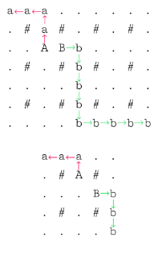

# Ozon_SandBox_25

Тренировочный раунд Route 256: Junior Go-разработчик, Январь 2025

# 7. ASCII - роботы

## Условие задачи

Склад маркетплейса имеет форму прямоугольника и разделен на клетки площадью $1 * 1$. Общая площадью склада $n * m$, где $n$ количество строк, $m$ количество столбцов, пронумерованных от 1 до $n$ и от 1 до $m$ соответственно. Известно, что все клетки склада с четными индексами строки и столбца заняты стойками, остальные свободны для перемещения. Также известно что склад состоит из нечетного количества строк и столбцов.

На двух различных свободных для перемещения клетках расположены роботы моделей **A** и **B**. Роботы могут перемещаться в соседнюю по вертикали или горизонтали свободную клетку. Вам необходимо построить два непересекающихся маршрута, которые приведут одного из роботов в верхнюю левую клетку склада $(1;1)$, а другого в нижнюю правую $(n;m)$. Обратите внимание, минимизировать длину маршрутов роботов не требуется. Какой из роботов окажется в верхней левой клетке, а какой в правой нижней - не важно. Путь робота должен быть простым, то есть робот не может посещать клетку, в которую он уже перемещался

## Входные данные

Первая строка содержит целое число $t\ (1 <= t <= 10^5)\ -$ количество наборов входных данных.

Далее следует описание наборов входных данных.

Первая строка каждого набора входных данных содержит два нечетных целых числа $n$ и $m$ $(3 <= n,m < 100)$ количество строк и столбцов склада.

Следующие $n$ строк каждого набора входных данных содержат по $m$ символов в каждой - описание схемы склада. Стойки обозначаются символов **#**, свободные клетки символов **.**, а роботы - символами **A** и **B**.

## Выходные данные

Для каждого набора входных данных выведите $n$ строк по $m$ символов в каждой. Путь робота **А** обозначьте символами **а**, а путь робота **B** символами **b**.

### Пример 1

**Входные данные**\
1\
3 3\
B..\
.#.\
..A

**Выходные данные**\
B..\
.#.\
..A

### Пример 2

**Входные данные**\
2\
5 5\
.....\
.#A#.\
...B.\
.#.#.\
.....\
7 9\
.........\
.#.#.#.#.\
..AB.....\
.#.#.#.#.\
.........\
.#.#.#.#.\
.........

**Выходные данные**\
aaa..\
.#A#.\
...Bb\
.#.#b\
....b\
aaa......\
.#a#.#.#.\
..ABb....\
.#.#b#.#.\
....b....\
.#.#b#.#.\
....bbbbb

## Замечание

Пояснение к первому примеру: **A** и **B** - это роботы, **a** и **b** - это их путь, стрелками показано как они двигаются. Точки - это пустые клетки. Решетки - это стойки (занятые клетки)

